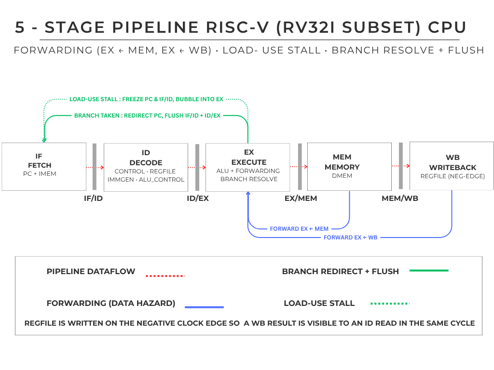
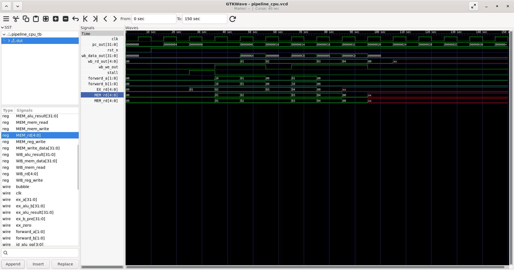

# Pipelined RISC-V (RV32I) CPU

A 32-bit RISC-V processor implementing a working subset of the RV32I base integer instruction set, written in Verilog and verified through simulation. Built in two stages: a single-cycle core, then a 5-stage pipelined version with data forwarding, load-use hazard handling, and branch execution.

**Implemented instructions:** R-type (`add`, `sub`, `and`, `or`, `xor`, `slt`, `sll`, `srl`), I-type ALU (`addi`, `andi`, `ori`, `xori`, `slti`, `slli`, `srli`), `lw`, `sw`, and conditional branches (`beq`, `bne`). Jumps (`jal`/`jalr`), `lui`/`auipc`, byte/half memory accesses, and `sra` are not yet implemented.

## Pipeline architecture

## Project structure

- `single_cycle/` — Single-cycle RV32I core (the foundation)
- `pipelined/` — 5-stage pipelined version with forwarding and hazard handling

## Features

- 5-stage pipeline (IF / ID / EX / MEM / WB)
- Full ALU-operation decode from `funct3`/`funct7` (add, sub, and, or, xor, slt, sll, srl)
- R-type and I-type arithmetic, plus loads and stores
- Conditional branches (`beq`/`bne`) resolved in the EX stage, with a two-instruction flush on a taken branch
- Data forwarding from the MEM and WB stages to resolve data hazards
- Load-use hazard detection with one-cycle pipeline stalling
- Register file with two read ports and one write port (x0 hard-wired to zero; written on the negative clock edge so a writeback is visible to a same-cycle decode read)
- Verified with a self-checking testbench covering ALU ops, forwarding, a load-use stall, and a taken branch

## Modules

| Module           | Role                                                     |
|------------------|----------------------------------------------------------|
| `pipeline_cpu.v` | Top-level CPU integrating all five stages                |
| `forwarding.v`   | Forwarding unit (selects MEM/WB bypass for ALU operands) |
| `hazard.v`       | Load-use hazard detection (generates the stall signal)   |
| `alu.v`          | Arithmetic Logic Unit with zero flag                     |
| `regfile.v`      | 32 x 32-bit register file                                |
| `immgen.v`       | Immediate generator with sign extension                  |
| `control.v`      | Main decoder generating control signals                  |
| `alu_control.v`  | Decodes opcode + funct3 + funct7 into the ALU operation  |
| `dmem.v`         | Data memory for loads and stores                         |

## Example 1: load-use hazard handled correctly

    lw   x1, 0(x0)     # x1 = mem[0] = 100
    add  x2, x1, x1    # uses x1 immediately after the load
    addi x3, x0, 5
    add  x4, x2, x3

Verified output: `x1 = 100`, `x2 = 200`, `x3 = 5`, `x4 = 205`.
The `add` right after the load triggers a one-cycle stall; forwarding then delivers the loaded value.

## Example 2: ALU-op decode + a taken branch

    addi x1, x0, 5
    addi x2, x0, 3
    addi x7, x0, 7     # x7 = 7  (a known value, set before the branch)
    and  x3, x1, x2    # = 1
    or   x4, x1, x2    # = 7
    xor  x5, x1, x2    # = 6
    slt  x6, x1, x2    # = 0  (5 < 3 is false)
    beq  x0, x0, +8    # always taken -> skips the next instruction
    addi x7, x0, 99    # FLUSHED, never commits  -> x7 stays 7
    addi x8, x0, 42    # branch lands here

Verified output: `x3 = 1`, `x4 = 7`, `x5 = 6`, `x6 = 0`, `x7 = 7` (preserved), `x8 = 42`.
This exercises every ALU operation and proves the branch redirect/flush works: x7 is set to 7
before the branch, the taken branch skips the `addi x7, x0, 99`, and because that wrong-path
instruction is flushed before reaching writeback, x7 keeps its original value of 7.

## Simulation waveform

The `stall` signal pulses high when a load-use hazard is detected, freezing the PC for one cycle. The `forward_a` / `forward_b` signals show when operands are bypassed from later stages directly to the ALU.

## How to run

Requires Icarus Verilog (and optionally GTKWave for waveforms).

    cd pipelined
    iverilog -o sim rtl/pipeline_cpu.v rtl/alu_control.v rtl/forwarding.v rtl/hazard.v rtl/dmem.v rtl/control.v rtl/regfile.v rtl/immgen.v rtl/alu.v tb/pipeline_cpu_tb.v
    vvp sim
    gtkwave pipeline_cpu.vcd

## Tools

- Verilog (RTL design)
- Icarus Verilog (simulation)
- GTKWave (waveform analysis)

## Author

Raghad Faleh Alharthi — Computer Engineering 