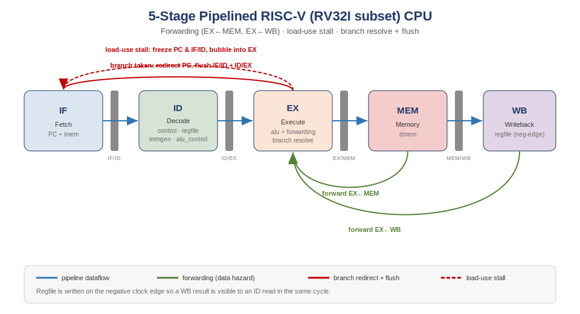

# Pipelined RISC-V (RV32I) CPU

A 32-bit RISC-V processor implementing the RV32I base integer instruction set, written in Verilog and verified through simulation. Built in two stages: a single-cycle core, then a 5-stage pipelined version with data forwarding and hazard handling.

## Pipeline architecture

## Project structure

- `single_cycle/` — Single-cycle RV32I core (the foundation)
- `pipelined/` — 5-stage pipelined version with forwarding and hazard handling

## Features

- 5-stage pipeline (IF / ID / EX / MEM / WB)
- R-type and I-type arithmetic, plus loads and stores
- Data forwarding from the MEM and WB stages to resolve data hazards
- Load-use hazard detection with one-cycle pipeline stalling
- Register file with two read ports and one write port (x0 hard-wired to zero)
- Verified with dependency-heavy test programs

## Modules

| Module           | Role                                                     |
|------------------|----------------------------------------------------------|
| `pipeline_cpu.v` | Top-level CPU integrating all five stages                |
| `pipe_reg.v`     | Generic pipeline register (supports stall and flush)     |
| `forwarding.v`   | Forwarding unit (selects MEM/WB bypass for ALU operands) |
| `hazard.v`       | Load-use hazard detection (generates the stall signal)   |
| `alu.v`          | Arithmetic Logic Unit with zero flag                     |
| `regfile.v`      | 32 x 32-bit register file                                |
| `immgen.v`       | Immediate generator with sign extension                  |
| `control.v`      | Main decoder generating control signals                  |
| `dmem.v`         | Data memory for loads and stores                         |

## Example: load-use hazard handled correctly

    lw   x1, 0(x0)     # x1 = mem[0] = 100
    add  x2, x1, x1    # uses x1 immediately after the load
    addi x3, x0, 5
    add  x4, x2, x3

Verified output:

    x1 = 100
    x2 = 200    # correct, thanks to load-use stall + forwarding
    x3 = 5
    x4 = 205

The `add` immediately after the load triggers a one-cycle stall; forwarding then delivers the loaded value, producing the correct result.

## Simulation waveform

The `stall` signal pulses high when a load-use hazard is detected, freezing the PC for one cycle. The `forward_a` / `forward_b` signals show when operands are bypassed from later stages directly to the ALU.

## How to run

Requires Icarus Verilog (and optionally GTKWave for waveforms).

    cd pipelined
    iverilog -o sim rtl/pipeline_cpu.v rtl/forwarding.v rtl/hazard.v rtl/dmem.v rtl/control.v rtl/regfile.v rtl/immgen.v rtl/alu.v tb/pipeline_cpu_tb.v
    vvp sim
    gtkwave pipeline_cpu.vcd

## Tools

- Verilog (RTL design)
- Icarus Verilog (simulation)
- GTKWave (waveform analysis)

## Author

Raghad Faleh Alharthi — Computer Engineering 